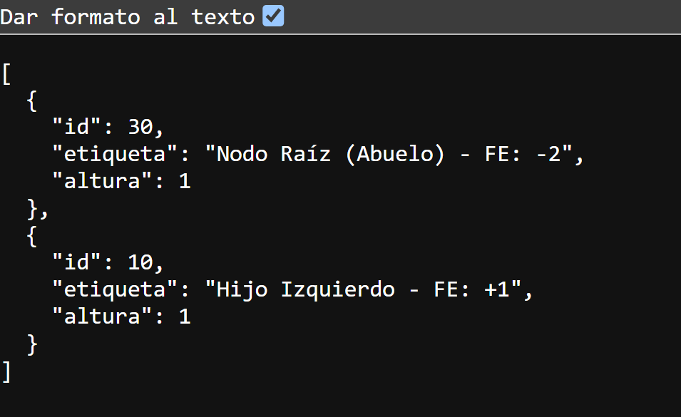
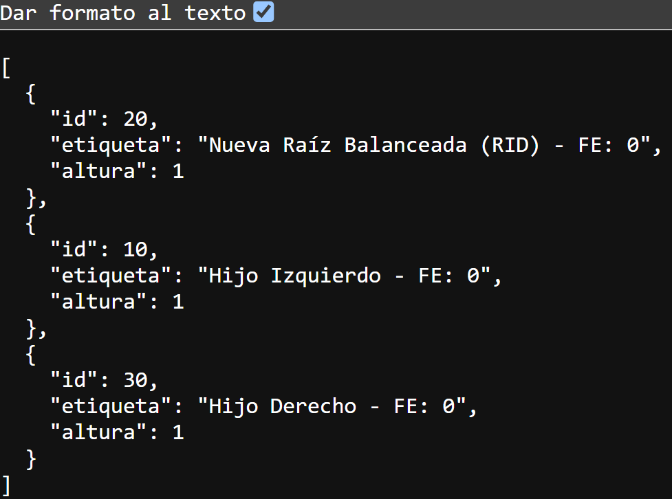

# Actividad 12 - Balanceo Compuesto en Árboles AVL y Exposición de Estructuras vía Web APIs

- 202500007 Edgar Daniel Cabrera Arévalo


---

# Parte 1: Investigación Teórica y Análisis de Casos

## 1. El límite de las rotaciones simples y desbalanceo en Zig-Zag

### El Problema Cruzado

Las rotaciones simples funcionan correctamente cuando el desbalance ocurre en una misma dirección, como Izquierda-Izquierda o Derecha-Derecha.

Sin embargo, cuando se insertan valores en forma cruzada, por ejemplo:

```text
30, 10, 20
```

se genera la siguiente estructura:

```text
    30
   /
 10
   \
   20
```

En este caso el nodo padre presenta un desbalance hacia la izquierda, mientras que su hijo izquierdo presenta una inclinación hacia la derecha.

La condición matemática para aplicar una Rotación Izquierda-Derecha (RID) es:

```text
FE(Padre) = -2
FE(Hijo Izquierdo) = +1
```

Por esta razón una rotación simple no corrige completamente el problema, siendo necesaria una rotación doble.

El resultado final es:

```text
    20
   /  \
 10    30
```

---

### Principio DRY (Don't Repeat Yourself)

El principio DRY establece que una misma lógica no debe repetirse innecesariamente.

En el caso de las rotaciones dobles:

```text
RID = Rotación Izquierda + Rotación Derecha

RDI = Rotación Derecha + Rotación Izquierda
```

Implementar las rotaciones dobles reutilizando las rotaciones simples permite:

- Reducir código duplicado.
- Facilitar el mantenimiento.
- Disminuir errores.
- Mejorar la reutilización de funciones.
- Mantener una arquitectura más limpia.

---

## 2. Fundamentos de Arquitectura Web y Protocolo HTTP

### Modelo Cliente-Servidor

La arquitectura Cliente-Servidor permite la comunicación entre aplicaciones mediante solicitudes y respuestas HTTP.

```text
Cliente ---- Request ----> Servidor

Cliente <--- Response ---- Servidor
```

El cliente puede ser:

- Navegador Web
- Aplicación móvil
- Postman
- Otro servicio web

El servidor recibe la solicitud, procesa la información y devuelve una respuesta.

Las respuestas normalmente se devuelven en formato JSON.

---

### Diferencia entre GET y POST

#### GET

Permite recuperar información del servidor.

Ejemplo:

```http
GET /api/arbol
```

Su objetivo es consultar información sin modificar datos.

---

#### POST

Permite enviar información al servidor.

Ejemplo:

```http
POST /api/arbol/insertar
```

Su objetivo es insertar o modificar datos.

---

# Parte 2: Implementación Práctica

## Creación del Proyecto

Se creó una Web API utilizando ASP.NET Core Minimal APIs.

Comandos utilizados:

```bash
dotnet new webapi -o ApiAvlSimulacion

cd ApiAvlSimulacion

dotnet build

dotnet run
```

---

## Modelo Utilizado

```csharp
public class NodoAVL
{
    public int Id { get; set; }

    public string Etiqueta { get; set; } = string.Empty;

    public int Altura { get; set; } = 1;
}
```

---

## Endpoints Implementados

### GET

```http
GET /api/arbol
```

Recupera la estructura actual del árbol AVL.

---

### POST

```http
POST /api/arbol/insertar
```

Simula la inserción de un nodo.

Cuando se inserta el valor 20, se ejecuta una Rotación Izquierda-Derecha (RID) para balancear el árbol.

---

# Parte 3: Pruebas de Verificación

## Paso A - Estado Inicial del Árbol

Se verificó el estado inicial del árbol AVL utilizando el endpoint GET.



---

## Paso B - Inserción del Nodo 20

Se realizó una petición POST al endpoint de inserción utilizando el siguiente JSON:

```json
{
  "id": 20,
  "etiqueta": "Nieto Derecho"
}
```

La API ejecutó la simulación de la Rotación Izquierda-Derecha (RID).


---

## Paso C - Verificación Final

Después de la rotación, el nodo 20 pasó a ser la nueva raíz del árbol AVL balanceado.



---

# Relación con el Ejemplo 10

Esta actividad se relaciona directamente con el Ejemplo 10: Cliente HTTP y Comunicación Inter-Proceso.

Los conceptos aplicados son:

- Arquitectura Cliente-Servidor.
- Servicios REST.
- Endpoints HTTP.
- Métodos GET y POST.
- Intercambio de información mediante JSON.
- Comunicación entre aplicaciones mediante HTTP.

La API desarrollada puede ser consumida por aplicaciones externas utilizando HttpClient, tal como se explica en el Ejemplo 10.

---


# Referencias

- Material de clase: Sesión 10 - Rotaciones Dobles en Árboles AVL.
- Material de clase: Ejemplo 10 - Cliente HTTP y Comunicación Inter-Proceso.

