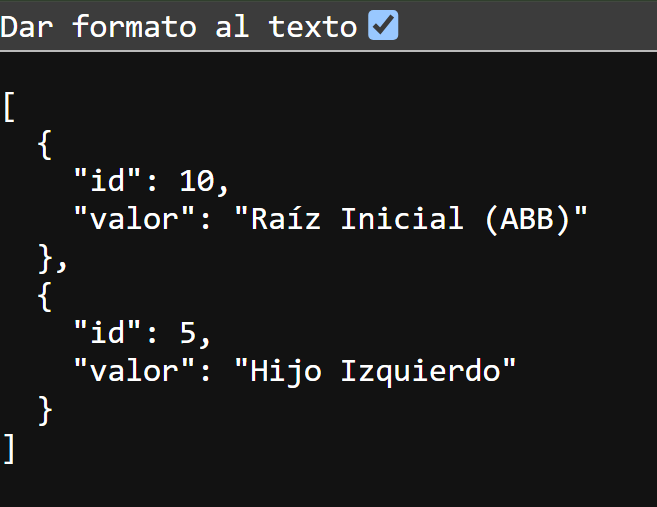
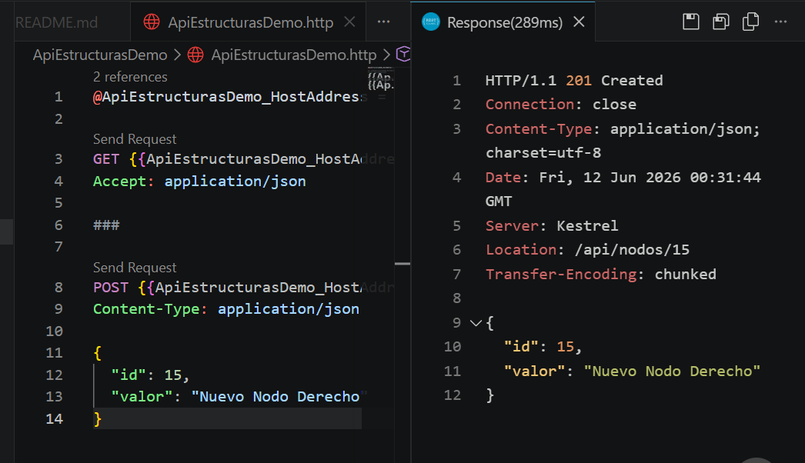
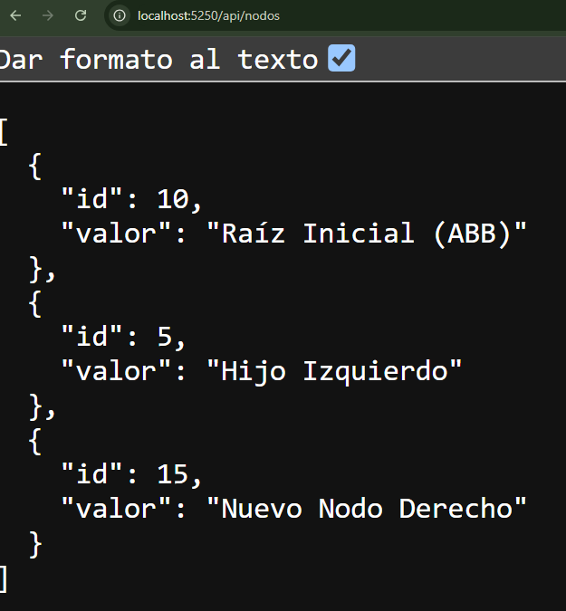

# Actividad de Investigación y Práctica

## Estructuras de Datos Avanzadas y APIs con ASP.NET Core

**Nombre:** Edgar Daniel Cabrera Arévalo  
**Carné:** 202500007

---

# Parte 1: Investigación Teórica

## 1. Estructuras de Datos Eficientes

### Árboles Binarios de Búsqueda (ABB)

Un Árbol Binario de Búsqueda (ABB) es una estructura de datos jerárquica en la que cada nodo puede tener como máximo dos hijos.

#### Regla de Ordenamiento

- Los valores menores que el nodo actual se almacenan en el subárbol izquierdo.
- Los valores mayores que el nodo actual se almacenan en el subárbol derecho.

**Ejemplo:**

```text
        10
       /  \
      5   15
```

#### Principal Desventaja

Cuando los datos se insertan en orden secuencial, el árbol puede degenerarse y comportarse como una lista enlazada.

**Ejemplo:**

```text
10
 \
  20
   \
    30
     \
      40
```

En este caso, las operaciones de búsqueda, inserción y eliminación dejan de ejecutarse en O(log n) y pasan a O(n), disminuyendo considerablemente la eficiencia.

---

### Árboles AVL

Un árbol AVL es un Árbol Binario de Búsqueda auto-balanceado que mantiene equilibrada la altura de sus subárboles mediante rotaciones.

#### Factor de Balanceo

El factor de balanceo se calcula mediante la siguiente fórmula:

```text
Factor = Altura(Izquierda) - Altura(Derecha)
```

Un nodo se considera balanceado cuando su factor es:

```text
-1, 0 o 1
```

Si el factor es menor que -1 o mayor que 1, el árbol realiza rotaciones para recuperar el equilibrio.

#### Complejidad

Gracias a su balanceo automático, la altura del árbol se mantiene cercana a log₂(n), permitiendo que las operaciones principales conserven una complejidad logarítmica.

| Operación | Complejidad |
|-----------|-------------|
| Búsqueda | O(log n) |
| Inserción | O(log n) |
| Eliminación | O(log n) |

---

## 2. Fundamentos de Web APIs

### ¿Qué es una API y cómo funciona el modelo Cliente-Servidor?

Una API (Application Programming Interface) es un conjunto de reglas que permite la comunicación entre diferentes aplicaciones de software.

El modelo Cliente-Servidor funciona de la siguiente manera:

1. El cliente envía una petición (Request).
2. El servidor recibe y procesa la solicitud.
3. El servidor devuelve una respuesta (Response).

La comunicación se realiza generalmente mediante el protocolo HTTP.

#### Flujo de Comunicación

```text
Cliente
   |
   | Request HTTP
   v
Servidor / API
   |
   | Response HTTP
   v
Cliente
```

Por ejemplo, una aplicación puede solicitar información a una API mediante una petición HTTP y recibir una respuesta en formato JSON.

---

## Verbos HTTP

### GET

#### Definición

El método GET se utiliza para recuperar información o consultar recursos existentes en el servidor.

#### Ejemplo

```http
GET /api/nodos
```

#### Idempotencia

GET es un método idempotente porque realizar la misma petición varias veces produce el mismo resultado y no modifica el estado del servidor.

---

### POST

#### Definición

El método POST se utiliza para crear nuevos recursos en el servidor.

#### Ejemplo

```http
POST /api/nodos
```

```json
{
  "id": 15,
  "valor": "Nuevo Nodo Derecho"
}
```

#### Idempotencia

POST no es un método idempotente porque ejecutar la misma petición varias veces puede generar múltiples recursos nuevos y modificar el estado del servidor.

---

# Parte 2: Implementación Práctica

## Creación del Proyecto

Se creó una Web API utilizando ASP.NET Core y .NET 10 mediante el siguiente comando:

```bash
dotnet new webapi -o ApiEstructurasDemo
```

Posteriormente se ingresó a la carpeta del proyecto:

```bash
cd ApiEstructurasDemo
```

## Modelo NodoElemento

Se creó una clase para representar un nodo dentro de la colección:

```csharp
namespace ApiEstructurasDemo.Models
{
    public class NodoElemento
    {
        public int Id { get; set; }

        public string Valor { get; set; } = string.Empty;
    }
}
```

## Implementación de Endpoints

Se implementaron dos endpoints:

### GET /api/nodos

Retorna todos los nodos almacenados en memoria.

### POST /api/nodos

Permite agregar un nuevo nodo a la colección validando que los datos sean correctos.

## Ejecución

La API se ejecutó mediante:

```bash
dotnet run
```

Una vez iniciada, quedó disponible en:

```text
http://localhost:5250
```

---

# Parte 3: Verificación y Pruebas

## Prueba GET

Petición realizada:

```http
GET /api/nodos
```

Resultado obtenido:



---

## Prueba POST

Petición realizada:

```http
POST /api/nodos
```

Cuerpo enviado:

```json
{
  "id": 15,
  "valor": "Nuevo Nodo Derecho"
}
```

Resultado obtenido:



---

## Verificación Final

Después de ejecutar el POST se realizó nuevamente la petición GET para comprobar la inserción del nuevo nodo.

